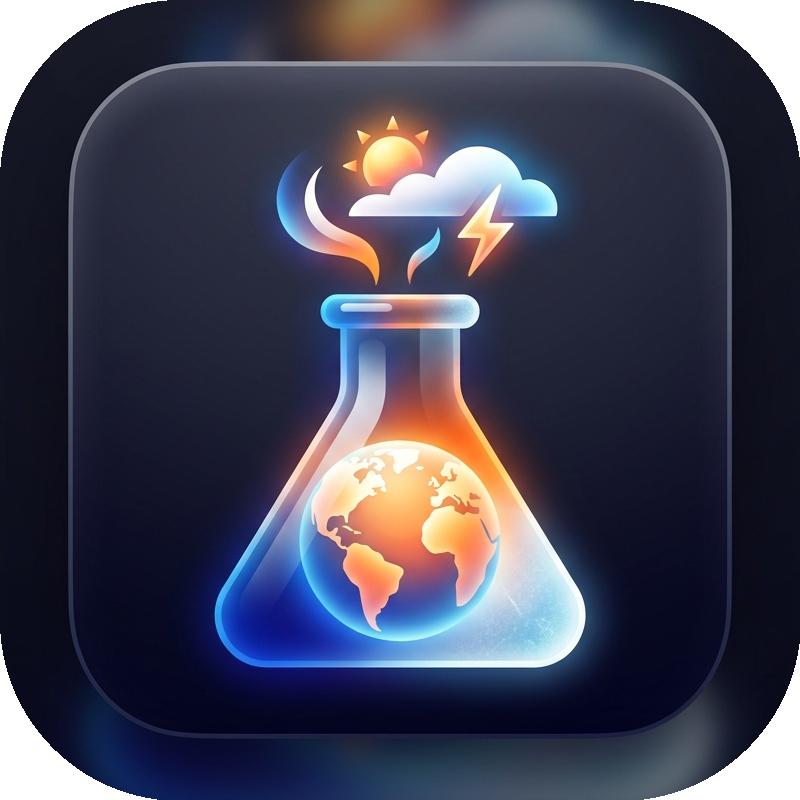
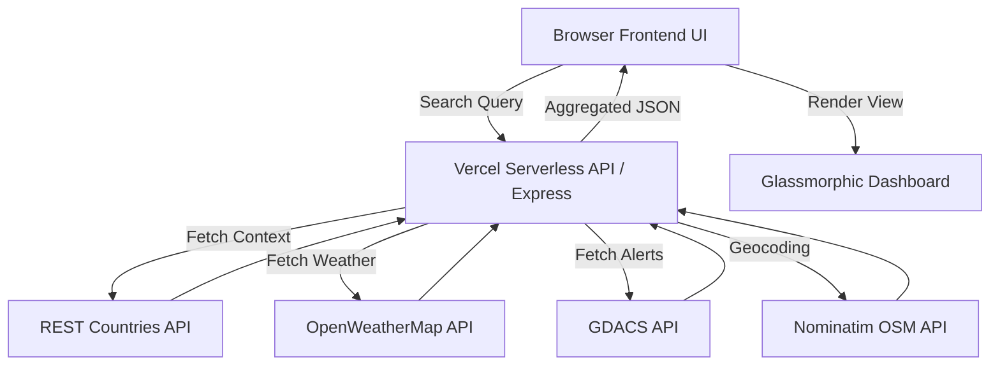

<p align="center">
  
</p>

# 🌍 TerraBrewer

A high-performance, secure **country & capital  weather explorer** featuring a Vercel-ready **Express.js serverless backend** and a visually stunning **Vanilla JS + CSS frontend**. Explore real-time weather, disaster alerts, and comprehensive country metrics through a premium, glassmorphic interface.

## ✨ Key Features

- ⚡ **Serverless Backend** — Lightweight, high-performance Vercel serverless functions proxy requests, securing API keys and handling CORS seamlessly.
- 🎨 **Glorious UI** — Beautifully crafted, responsive interface featuring intense glassmorphism, fluid micro-animations, animated SVGs, and a sleek Light/Dark mode toggle.
- ⛈️ **Real-time Weather** — Live updates, 5-day forecasts, and precise conditions fetched via the **OpenWeatherMap API**.
- 🚨 **Disaster Intelligence** — Integrated real-time disaster alerts and event mapping powered by **GDACS**.
- 📍 **Safety Locators** — Dynamic lookup of nearby critical infrastructure like hospitals and police stations.
- 🌍 **Country Metrics** — Detailed geographic and geopolitical data (population, capitals, currencies, driving side) via the **REST Countries API**.
- 📊 **Interactive Analytics** — Visualized environmental trends using **Chart.js** for intuitive forecasting.

## 🧠 System Architecture

TerraBrewer utilizes a **multi-source data fusion engine** coordinated by serverless backend endpoints:



The application intelligently merges these streams to provide a holistic view of any location on Earth, keeping your API keys hidden from the frontend.

## 🚀 Getting Started

### 🔧 Prerequisites

- **Node.js** (v14.x or higher)
- **OpenWeatherMap API Key** ([Get one here](https://openweathermap.org/api))

### 🛠️ Local Installation

1. Clone this repository:
```bash
git clone https://github.com/HeX-ecutioner/terrabrewer.git
cd terrabrewer
```

2. Install dependencies:
```bash
npm install
```

3. Create your environment file by duplicating `.env.example`:
```bash
cp .env.example .env
```

4. Add your API key inside `.env`:
```env
OPENWEATHER_API_KEY="YOUR_API_KEY_HERE"
```

### ▶️ Running the App Locally

Start the optimized development server:
```bash
npm start
```

Then, seamlessly open `http://localhost:3000` in your browser!

## ☁️ Deployment (Vercel)

TerraBrewer is fully optimized for edge deployment on **Vercel**. The application structure maps the `api/` directory directly to serverless functions via `vercel.json`.

1. Install the Vercel CLI:
```bash
npm i -g vercel
```
2. Link to your Vercel project and deploy:
```bash
vercel
```
3. Add your `OPENWEATHER_API_KEY` to your Vercel project's Environment Variables.
4. Deploy to production:
```bash
vercel --prod
```

## ℹ️ Additional Information

### 📂 APIs Used
- **OpenWeatherMap** — Weather & Forecasts
- **REST Countries** — Global Country Data
- **GDACS** — Global Disaster Alerts
- **Nominatim (OSM)** — Geocoding & Search

### 📦 Dependencies
- **express** — Backend Framework
- **dotenv** — Environment Management
- **node-fetch** — Server-side API Requests
- **cors** — Cross-Origin Resource Sharing
- **Chart.js** — Frontend Data Visualization

### ⚖️ License

This app uses the [MIT License](LICENSE)